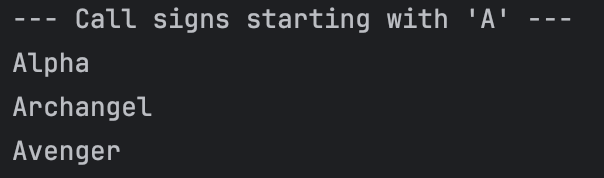
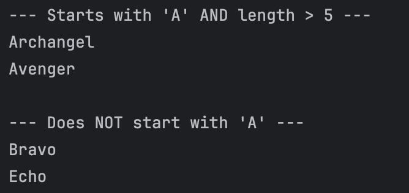

# Exploring Java Lambdas and Predicate
Submitted by: Baruc, Jana Enigma S.

### Exercise 1: The "New Way" - A Simple Lambda Expression
1. **Prediction**:
```
Is 'short' long? false
Is 'This is a very long string' long? true
```
* The first print statement will print `false` as the `String` "short", as evaluated in the Lambda expression, is less than 10. The second statement will print `true` because its length is more than 10 characters.
2. **Observation/Output**


### Exercise 2: Using Predicates to Filter a List
1. **Prediction**:
```
--- Call signs starting with 'A' ---
Alpha
Archangel
Avenger
```
* The code will only print out all the Strings that starts with the letter `A` as that is what is being evaluated in the statement.
2. **Observation/Output**



### Exercise 3: Chaining Predicates (`and`, `negate`)
1. **Prediction**:
```
--- Starts with 'A' AND length > 5 ---
Archangel
Avenger

--- Does NOT start with 'A' ---
Bravo
Echo
```
* The code reuses the code from the previous exercise, but this time adding another statement to evaluate the strings in the list. This time, the first printing statement will output all the strings which starts with `A` and has a length that is **less than 5**. The second print statement will print out all the strings that do **not** start with `A` as the `negate()` method was used here.
2. **Observation/Output**

