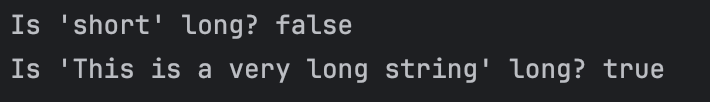

# Exploring Java Lambdas and Predicate
Submitted by: Baruc, Jana Enigma S.

### Exercise 1: The "New Way" - A Simple Lambda Expression
1. **Prediction**:
```
Is 'short' long? false
Is 'This is a very long string' long? true
```
* The first print statement will print `false` as the `String` "short", as evaluated in the Lambda expression, is less than 10. The second statement will print `true` because its length is more than 10 characters.
2. **Observation/Output**

